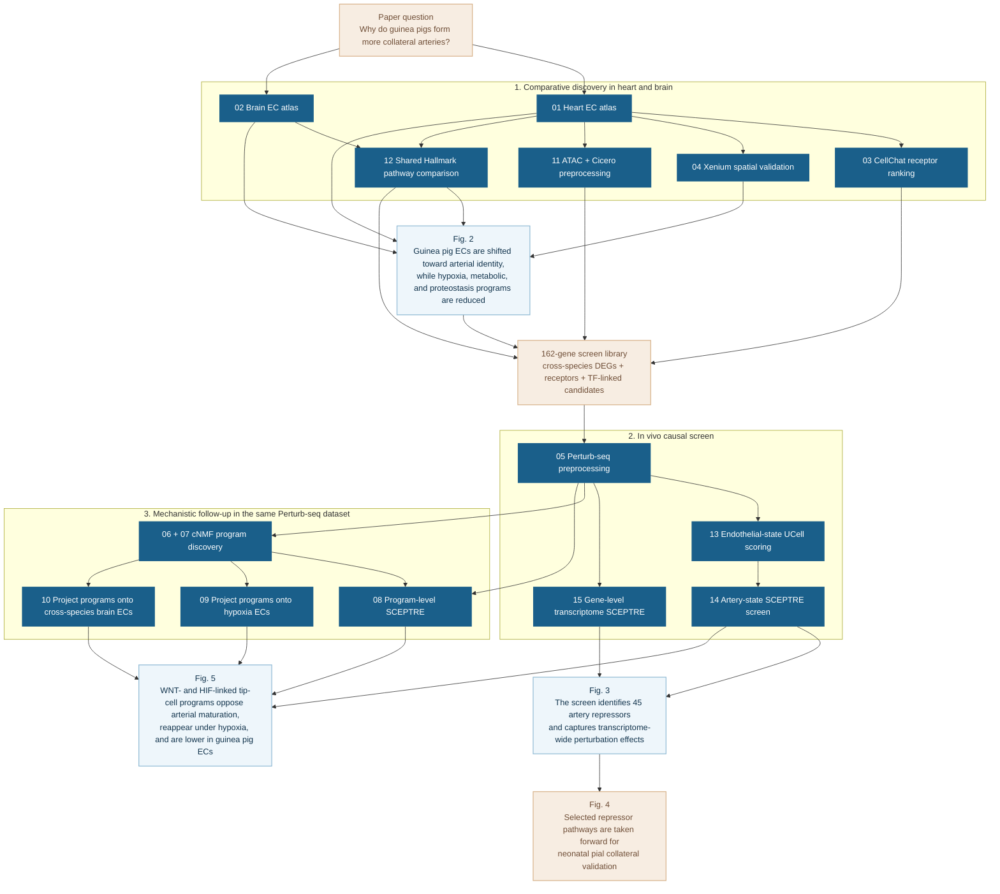

# Collateral Artery Perturb-seq: Code Repository

This repository contains the computational analysis code accompanying the manuscript:

**"A cross-species Perturb-seq platform identifies artery repressors that govern collateral artery formation"**

All computational analyses were performed using the custom scripts provided here. Raw sequencing data are deposited in GEO (accession pending).

> **Note on completeness**: Several analyses described in the manuscript (CellOracle GRN construction, scFEA, CellRank trajectory analysis, hypoxia scRNA-seq preprocessing, within-screen attenuation analysis, and endothelial subtype program enrichment) are not yet represented by a released script.

---

## Abstract

Collateral arteries are natural bypasses that can re-route blood flow around arterial blockages, limiting tissue injury during stroke and coronary artery disease. Despite their clinical effectiveness, therapeutic strategies to stimulate collateral artery growth are non-existent due to our limited understanding of their developmental mechanisms. Remarkably, guinea pigs display exceptionally dense collateral artery networks across various organs, resulting in complete resistance to ischemic damage, including in the brain and heart. In this study, we compared single-cell RNA sequencing (scRNAseq) from guinea pig and mouse tissues to identify unique endothelial cell (EC) gene expression patterns associated with extensive collateral artery development. Then, we designed an in vivo Perturb-seq platform to identify which genes differentially expressed in guinea pigs influence artery EC specification. This pipeline identified artery repressors that were downregulated in guinea pigs and that increased pial collaterals when inhibited in mice. Using Perturb-seq data to analyze how these guinea pig-depleted artery repressors affected transcriptional networks suggested that they promote artery EC specification by suppressing hypoxia-responsive programs related to VEGF and Wnt signaling in two capillary EC subsets—*Esm1+* pre-artery and *Apln+* angiogenic tip cells. Collectively, our study presents a platform for discovering the genes underlying species-specific traits, suggests that guinea pigs have collaterals due to decreased artery inhibitor pathways, and identifies novel targets for stimulating collateral artery formation.

---

## Repository Structure

```
analysis/
├── 01_cross_species_atlas/          # Cross-species scRNA-seq/ATAC-seq integration and spatial validation
│   ├── 01_heart_ec_crossspecies_integration.R
│   ├── 02_brain_ec_crossspecies_integration.R
│   ├── 03_heart_ec_cellchat_ligand_receptor.R
│   ├── 04_heart_xenium_ec_pseudobulk_validation.R
│   ├── 11_heart_ec_atac_signac_cicero_preprocessing.R
│   └── 12_heart_brain_ec_hallmark_pathway_comparison.py
│
├── 02_perturbseq_screen/            # In vivo Perturb-seq preprocessing and SCEPTRE artery-score screen
│   ├── 05_perturbseq_endothelial_preprocessing.R
│   ├── 13_endothelial_state_ucell_scoring.R
│   ├── 14_endothelial_state_sceptre_artery_score.R
│   └── 15_perturbseq_gene_level_sceptre_transcriptome.R
│
├── 03_gene_program_analysis/        # cNMF program discovery, SCEPTRE testing, and cross-dataset projection
│   ├── 06_perturbseq_cnmf_k100_factorization.py
│   ├── 07_perturbseq_cnmf_discovery_notebook.ipynb
│   ├── 08_perturbseq_cnmf_program_sceptre.R
│   ├── 09_project_programs_onto_hypoxia_normoxia.py
│   └── 10_project_programs_onto_crossspecies_brain_ec.py
│
genome_reference/                    # Guinea pig genome reference build scripts and configuration
    ├── Genome_reference.md
    ├── CavPor4.config
    ├── BSgenome.CPorcellus.NCBI.cavPor4-seed
    └── reproduce_guinea_pig_genome_reference_build.R
```

### Script Overview

| # | Script | Module | What it does |
|---|---|---|---|
| 01 | `01_heart_ec_crossspecies_integration.R` | Cross-species atlas | Heart scRNA-seq QC, ortholog remapping, Seurat CCA integration, EC subtype annotation (Fig. 2a–d) |
| 02 | `02_brain_ec_crossspecies_integration.R` | Cross-species atlas | Brain scRNA-seq integration and EC annotation (Fig. 2h, 2k) |
| 03 | `03_heart_ec_cellchat_ligand_receptor.R` | Cross-species atlas | CellChat ligand-receptor analysis; EC receptor candidates for screen library (Fig. 2g) |
| 04 | `04_heart_xenium_ec_pseudobulk_validation.R` | Cross-species atlas | Xenium spatial pseudobulk DE, spatial validation of cross-species EC differences (Fig. 2e–f, 2j) |
| 05 | `05_perturbseq_endothelial_preprocessing.R` | Perturb-seq screen | Perturb-seq QC, cluster pruning, guide filtering, SCEPTRE/cNMF export (Fig. 3b–e) |
| 06 | `06_perturbseq_cnmf_k100_factorization.py` | Gene program analysis | cNMF k=100 factorization, command-line parallel execution (Fig. S6a) |
| 07 | `07_perturbseq_cnmf_discovery_notebook.ipynb` | Gene program analysis | Interactive cNMF rank sweep and parameter exploration notebook |
| 08 | `08_perturbseq_cnmf_program_sceptre.R` | Gene program analysis | SCEPTRE program-level perturbation testing (Fig. 5e–h) |
| 09 | `09_project_programs_onto_hypoxia_normoxia.py` | Gene program analysis | STARcat projection onto hypoxia/normoxia dataset (Fig. 5m–q) |
| 10 | `10_project_programs_onto_crossspecies_brain_ec.py` | Gene program analysis | STARcat projection onto cross-species brain EC atlas (Fig. 5q) |
| 11 | `11_heart_ec_atac_signac_cicero_preprocessing.R` | Cross-species atlas | Signac ATAC QC, cross-species depth-matching, Cicero coaccessibility (Fig. S1) |
| 12 | `12_heart_brain_ec_hallmark_pathway_comparison.py` | Cross-species atlas | decoupler AUCell on MSigDB Hallmark gene sets, cross-organ concordance (Fig. 2h) |
| 13 | `13_endothelial_state_ucell_scoring.R` | Perturb-seq screen | ROC marker selection, UCell state scoring; exports score matrix for Script 14 |
| 14 | `14_endothelial_state_sceptre_artery_score.R` | Perturb-seq screen | Primary SCEPTRE artery-score screen; identifies 45 artery repressors (Fig. 3g–h, 5a–b) |
| 15 | `15_perturbseq_gene_level_sceptre_transcriptome.R` | Perturb-seq screen | Transcriptome-wide gene-level SCEPTRE, all-cells and per-cell-type |

---

## Analysis-to-Paper Map



*Dark boxes are released scripts in this repository. Light boxes summarize the manuscript claim each script block supports. This map focuses on released code, and unreleased analyses are noted above where relevant.*

---

### Module 1 — Cross-Species Endothelial Cell Atlas (`01_cross_species_atlas/`)

**Script 01** (`01_heart_ec_crossspecies_integration.R`): Preprocesses and integrates embryonic heart scRNA-seq from three mouse stages (E13.5, E15.5, E17.5) and matched guinea pig stages (GD25, GD32, GD35). Performs sample QC, scDblFinder doublet detection, guinea pig-to-mouse ortholog remapping via a BioMart one-to-one ortholog table, and Seurat v4 CCA integration. Endothelial clusters are re-embedded at higher resolution and annotated into large artery, arteriole, capillary, and venous states using canonical markers (*Gja5*, *Gja4*, *Cxcr4*, *Nr2f2*, *Apln*). Produces the heart EC atlas used by Scripts 03, 04, 11, and 12 and the scFEA analysis (Methods: Cross-species scRNA-seq processing; Fig. 2a–d, S2–S3).

**Script 02** (`02_brain_ec_crossspecies_integration.R`): Applies the same preprocessing and Seurat v4 CCA integration strategy to CD31+-sorted brain ECs from mouse (E18, P0) and guinea pig (GD35). Stricter QC thresholds account for FACS enrichment; guinea pig cells are additionally screened by ribosomal content. Produces the brain EC atlas annotated into arterial, pre-artery, capillary, cycling, and venous states, used by Scripts 10 and 12 (Methods: Cross-species scRNA-seq processing; Fig. 2h, 2k, S3a–c).

**Script 03** (`03_heart_ec_cellchat_ligand_receptor.R`): Constructs per-species CellChat objects from the annotated heart atlas and compares incoming signaling pathway strengths directed toward ECs between mouse and guinea pig. Maps cross-species DE onto the merged CellChat network to rank EC receptors by species-biased interaction strength, nominating the 50 top receptor candidates for the Perturb-seq library (pool 2 of 3) (Methods: CellChat ligand-receptor analysis; Fig. 2g, S3d–e).

**Script 04** (`04_heart_xenium_ec_pseudobulk_validation.R`): Processes Xenium spatial transcriptomics data from one embryonic heart per species (mouse E18, guinea pig GD40). Integrates four region outputs with Seurat v5 sketch-based CCA, isolates ECs, defines spatial pseudobulk replicates by k-means partitioning of cell centroids, and tests differential expression with DESeq2. Spatially validates cross-species differences in arterial identity (*Gja5*), canonical signaling (*Vegfa*, *Notch1*), TCA-cycle enzymes (*Idh2*, *Mdh2*, *Ogdh*), and protein chaperones (*Hsp90ab1*, *Hspa5*) (Methods: Xenium spatial transcriptomics; Fig. 2e–f, 2j).

**Script 11** (`11_heart_ec_atac_signac_cicero_preprocessing.R`): Builds Signac ChromatinAssay objects for heart Multiome ATAC data in both species using the custom mCavPor4.1 BSgenome package (genome_reference/). Applies per-cell QC filters (2,000–25,000 in-peak fragments, nucleosome signal < 2.5, TSS enrichment > 2) on barcodes from Script 01. Depth-matches mouse cells to guinea pig by binomial thinning (seed 42), converts to Monocle3 CDS, and runs Cicero (k=50 guinea pig; k=100 depth-matched mouse; seed 2013). Exports peak coaccessibility connections in CellOracle-compatible underscore-delimited format for use as the base GRN prior (Methods: scATAC-seq processing and Cicero; Fig. S1).

**Script 12** (`12_heart_brain_ec_hallmark_pathway_comparison.py`): Scores 50 MSigDB Hallmark gene sets (v2024.1) on preprocessed heart and brain EC AnnData objects using decoupler AUCell. Tests each pathway for species-biased activity per organ by Wilcoxon rank-sum test and retains pathways concordantly differential in both organs (FDR < 0.01, |log2FC| ≥ 0.25). Exports per-organ DE tables, a merged concordance table, and a combined dot-plot PDF (Methods: Pathway enrichment analysis; Fig. 2h).

---

### Module 2 — In Vivo Perturb-seq Screen (`02_perturbseq_screen/`)

**Script 05** (`05_perturbseq_endothelial_preprocessing.R`): Merges RNA and gRNA count matrices from ten sequencing batches of the neonatal brain CRISPRi Perturb-seq screen. Applies RNA QC thresholds (2,000–7,500 genes; 3,000–30,000 UMIs; < 10% mitochondrial), prunes non-endothelial clusters across three rounds, detects doublets with scDblFinder, and filters cells by guide multiplicity (≤ 15 guides; > 0 guide UMIs). Exports the filtered RNA + gRNA matrix and per-cell covariates as an RData bundle (SCEPTRE inputs for Scripts 08, 14, 15) and h5ad (cNMF input for Scripts 06–07) (Methods: Perturb-seq preprocessing; Fig. 3b–e, S4).

**Script 13** (`13_endothelial_state_ucell_scoring.R`): Derives UCell scores for six endothelial states (large artery, arteriole, pre-artery, tip, capillary, venous) from the filtered Perturb-seq object (Script 05). Uses ROC-based `FindAllMarkers` ranking to select state-specific marker sets (top 50 for artery-proximal states; top 30 for others) and runs `AddModuleScore_UCell` on the full dataset. Exports the per-cell score table and sparse score matrix consumed by Script 14 (Methods: Artery-state score derivation; prerequisite for Fig. 3g–h).

**Script 14** (`14_endothelial_state_sceptre_artery_score.R`): Runs the primary SCEPTRE v0.1.0 artery-score screen that identifies 45 artery repressors. Tests each perturbation against the six UCell state scores (Script 13) in high-MOI mode with mixture-model guide assignment and a regression formula including guide count, library size, batch, and broad cell-type covariates (`~ log(grna_n_nonzero) + log(grna_n_umis) + batch + cell_type_l1`). Artery repressors are defined as perturbations that significantly increase the artery or pre-artery score upon CRISPRi knockdown (Methods: SCEPTRE artery-score screen; Fig. 3g–h, 5a–b, S4k).

**Script 15** (`15_perturbseq_gene_level_sceptre_transcriptome.R`): CLI R script for transcriptome-wide gene-level SCEPTRE testing across the Perturb-seq endothelial dataset. Accepts `--gene-guide-input`, `--technical-covariates`, `--guide-target-annotation`, and `--output-root` arguments for compute-cluster submission. Uses UMI-threshold guide assignment (≥ 10 UMIs) and runs both all-cells and per-cell-type analyses (cell types with ≥ 200 cells). Supports `--dry-run` validation and `--all-cells-only` mode (Methods: Gene-level SCEPTRE testing).

---

### Module 3 — Gene Program Discovery and Cross-Dataset Projection (`03_gene_program_analysis/`)

**Script 06** (`06_perturbseq_cnmf_k100_factorization.py`): Command-line cNMF factorization at k=100, 200 replicates, 10,000 overdispersed genes on raw Perturb-seq UMI counts (h5ad from Script 05). Provides four sequential stages: `prepare`, `factorize-worker` (parallelizable across workers), `combine`, and `consensus` (local-density threshold 0.2). An `all-sequential` fallback supports single-machine runs. Produces the consensus spectra, per-cell usage matrix, and STARcat reference for Scripts 08–10.

```bash
python analysis/03_gene_program_analysis/06_perturbseq_cnmf_k100_factorization.py prepare \
  --source-h5ad data/final_pool_endothelial_cells.h5ad

parallel python analysis/03_gene_program_analysis/06_perturbseq_cnmf_k100_factorization.py \
  factorize-worker --total-workers 12 --worker-index {} ::: $(seq 0 11)

python analysis/03_gene_program_analysis/06_perturbseq_cnmf_k100_factorization.py combine
python analysis/03_gene_program_analysis/06_perturbseq_cnmf_k100_factorization.py consensus
```

**Script 07** (`07_perturbseq_cnmf_discovery_notebook.ipynb`): Companion notebook documenting the exploratory cNMF analysis that preceded the production run: initial k=15 run to assess batch effects, rank sweep across k=10–60 to select k=100, and the production run using the same settings as Script 06. The notebook is provided to clarify parameter selection rationale; the final outputs are identical to those produced by Script 06.

**Gene program annotation** (external): Each of the 100 cNMF programs was annotated using ProgExplorer ([https://github.com/ifanirene/ProgExplorer](https://github.com/ifanirene/ProgExplorer)), which integrates top gene loadings, STRING GO and KEGG enrichment (Mus musculus background, STRING v12.0), endothelial subtype-enrichment summaries, and perturbation-response data with a structured LLM annotation prompt to assign program names and regulator hypotheses. Annotated outputs are in the manuscript supplementary tables.

**Script 08** (`08_perturbseq_cnmf_program_sceptre.R`): Tests each CRISPRi perturbation against each of the 100 cNMF programs using SCEPTRE v0.10.0. Per-cell usage values are converted to count-like responses by multiplying the row-normalized usage vector by total UMI count. Supports all-cell and per-cell-type analysis modes via a configuration flag. Output discovery tables characterize how artery repressors act through WNT, HIF-glycolysis, VEGF-tip-cell, and neuronal-guidance programs (Methods: SCEPTRE program-level testing; Fig. 5e–h, S5b–j).

**Script 09** (`09_project_programs_onto_hypoxia_normoxia.py`): Projects the 100 cNMF consensus spectra (Script 06) onto normoxia (21% O₂) and mild hypoxia (11% O₂) neonatal mouse brain EC datasets using STARcat NNLS. Row-normalized usage scores are saved alongside batch and cell-type annotations. Tests whether HIF-glycolysis, WNT, and tip-cell programs elevated by artery repressor knockdown are also induced by oxygen reduction (Methods: STARcat projection; Fig. 5m–q).

**Script 10** (`10_project_programs_onto_crossspecies_brain_ec.py`): Applies the same STARcat projection to the cross-species brain EC atlas (Script 02). Because guinea pig cells have ortholog-mapped gene symbols, fitting uses only the 6,704 genes in the shared ortholog space. Tests whether program shifts associated with artery repressor knockdown are mirrored by species-biased program activity in brain ECs (Methods: STARcat projection; Fig. 5q, bottom row).

---

## Guinea Pig Genome Reference (`genome_reference/`)

The cross-species atlas and scATAC-seq analyses require two custom genome reference resources for *Cavia porcellus* that are not available from 10x Genomics or Bioconductor. Both are derived from the NCBI mCavPor4.1 assembly (GCF_034190915.1, RS_2024_02, February 2023). Build scripts and configuration files are in `genome_reference/`; large binary outputs (genome FASTA, Cell Ranger ARC reference tarball, R package tarball) are available upon request.

> **Version note**: All references to the guinea pig genome in this study use the NCBI assembly name **mCavPor4.1**. Internal build-iteration labels (CavPor4.2, CavPor4.3) that appear in R package names are implementation details only; the underlying genome sequence is unchanged from GCF_034190915.1.

### Custom Cell Ranger ARC Multiome Reference

Built with `cellranger-arc mkref` v2.0.2. The source GTF was filtered to retain only protein-coding and lncRNA genes (28,680 of 37,419 total) to reduce spurious multi-mapping; pseudogenes and small RNA genes were excluded. A custom JASPAR2024 Core vertebrates (non-redundant) motif file replaced the standard Cell Ranger ARC motif library. The 86 largest NCBI scaffold accessions (NW_026947484.1 through NW_026948059.1) were designated as primary contigs; there is no mitochondrial contig in this assembly release.

```bash
cellranger-arc mkref --config=CavPor4.config --nthreads=32 --memgb=256
```

- Config file: `genome_reference/CavPor4.config`
- Full build documentation (input files, biotype filter rationale, primary contig list): `genome_reference/Genome_reference.md`

### Custom BSgenome Data Package

The BSgenome package (`BSgenome.CPorcellus.NCBI.CavPor4.3`, v4.0) provides guinea pig genome sequences for Signac chromatin assay construction and motif scanning in R/Bioconductor. Built by converting the NCBI FASTA to 2-bit format with `faToTwoBit` (UCSC utilities, April 2021) and packaging with `BSgenome::forgeBSgenomeDataPkg()` in R 4.2.0. The package exposes 86 sequences with NCBI accession identifiers; in Signac and Cicero, underscores in seqlevels are replaced with hyphens before peak-matrix construction.

- Seed file: `genome_reference/BSgenome.CPorcellus.NCBI.cavPor4-seed`
- Build script (also covers TxDb and OrgDb construction): `genome_reference/reproduce_guinea_pig_genome_reference_build.R`
- Install from provided tarball: `R CMD INSTALL BSgenome.CPorcellus.NCBI.CavPor4.3_4.0.tar.gz`

---

## Data Availability

Raw sequencing data (FASTQ files) and processed count matrices for all experiments will be deposited in the NCBI Gene Expression Omnibus (GEO) upon publication. The following datasets are included:

| Dataset | Species | Assay | Stages / Conditions |
|---|---|---|---|
| Cross-species heart atlas | Mouse + guinea pig | scRNA-seq + scATAC-seq (10x Multiome) | Mouse E13.5, E15.5, E17.5; guinea pig GD25, GD32, GD35 |
| Cross-species brain atlas | Mouse + guinea pig | scRNA-seq (10x 3' v3.1), CD31+ FACS-sorted | Mouse E18, P0; guinea pig GD35 |
| Xenium spatial transcriptomics | Mouse + guinea pig | Xenium (299-gene homology-aware panel) | Mouse E18; guinea pig GD40 |
| In vivo Perturb-seq screen | Mouse | scRNA-seq + direct guide capture (10x GEM-X 3' v4) | Neonatal P1 AAV injection, P9 harvest; 10 replicates |
| Hypoxia vs. normoxia | Mouse | scRNA-seq (10x 3'), CD31+ FACS-sorted | P1–P8 exposure, 21% O₂ vs. 11% O₂ |

---

## Software Requirements

### Prerequisite — Cell Ranger (primary sequencing data processing)

| Software | Version | Purpose |
|---|---|---|
| Cell Ranger | 7.1.0 | Demultiplexing, alignment, and UMI counting for all scRNA-seq libraries (Perturb-seq, brain atlases, hypoxia) |
| Cell Ranger ARC | 2.0.2 | Joint RNA + ATAC counting for cross-species heart Multiome libraries |

### R Environment — Seurat 4 (Scripts 01–03, 05, 11, 13, 14, 15)

Scripts 01–03, 05, 11, 13, 14, and 15 were developed and validated in R 4.2.0 on a Linux (CentOS 7) system. An environment snapshot is recorded in the header of each script.

| Package | Version | Purpose |
|---|---|---|
| Seurat | 4.4.0 | Single-cell preprocessing, integration, clustering, and visualization |
| SeuratObject | 5.0.1 | Seurat object infrastructure |
| scDblFinder | 1.17.2 / 1.14.0 | Cluster-aware doublet detection (v1.17.2 for cross-species atlas; v1.14.0 for Perturb-seq preprocessing) |
| UCell | 2.2.0 | Rank-based gene signature scoring (artery-state scores) |
| BiocParallel | 1.32.5 | Parallel execution for doublet scoring |
| gprofiler2 | 0.2.3 | Ortholog mapping for cell-cycle gene sets |
| CellChat | 2.1.2 | Ligand-receptor communication inference (Script 03 only) |
| sceptre | 0.1.0 / 0.10.0 | CRISPRi perturbation testing (v0.1.0 for artery-score screen Scripts 14–15; v0.10.0 for program-level Script 08) |
| Signac | 1.10.0 | scATAC-seq QC and chromatin assay construction (Script 11) |
| Monocle3 | 1.3.1 | LSI dimensionality reduction for Cicero (Script 11; CellOracle environment) |
| Cicero | 1.3.9 | Peak-to-gene coaccessibility (cole-trapnell-lab/monocle3 branch; Script 11) |
| ggplot2 | 3.5.0 | Visualization |
| patchwork | 1.2.0 | Plot composition |
| dplyr | 1.1.4 | Table manipulation |

### R Environment — Seurat 5 (Script 04)

Script 04 requires Seurat v5 for sketch-based integration of Xenium region outputs:

| Package | Version | Purpose |
|---|---|---|
| Seurat | 5.3.0 | Xenium loading, sketch integration, and cluster projection |
| DESeq2 | 1.42.0 | Pseudobulk differential expression |
| jsonlite | 2.0.0 | Parsing Xenium experiment metadata |
| data.table | 1.17.8 | Reading `cells.csv.gz` per-cell metadata |

### Python Environment — cNMF and STARcat (Scripts 06, 07, 09, 10)

| Package | Version | Purpose |
|---|---|---|
| Python | ≥ 3.10 | Runtime |
| scanpy | 1.10.1 | AnnData handling and preprocessing (cNMF raw-count export) |
| anndata | 0.10.7 | AnnData I/O |
| cnmf | 1.7.0 | Consensus NMF factorization |
| starcatpy | 1.0.9 | NNLS-based projection onto cNMF reference spectra |
| scikit-learn | 1.0.2 | NNLS solver (used internally by STARcat) |
| numpy | | Numerical operations |
| pandas | | DataFrame handling |

### Python Environment — Pathway analysis (Script 12)

Script 12 runs in the `perturb2` conda environment (Python 3.12.9):

| Package | Version | Purpose |
|---|---|---|
| Python | 3.12.9 | Runtime |
| scanpy | 1.11.3 | Count matrix renormalization before scoring |
| decoupler | 2.1.1 | AUCell scoring of MSigDB Hallmark gene sets (v2024.1) |
| anndata | 0.11.4 | AnnData I/O |
| pandas | 2.2.3 | DataFrame handling |
| numpy | 2.2.4 | Numerical operations |
| scipy | 1.15.2 | Statistical testing |
| matplotlib | 3.10.1 | Figure rendering |
| seaborn | 0.13.2 | Plot styling |
| adjustText | 1.3.0 | Label de-overlapping |

### Python Environment — CellOracle (GRN construction; script not yet released)

| Package | Version | Purpose |
|---|---|---|
| Python | 3.8.18 | Runtime |
| CellOracle | 0.18.0 | GRN construction and in silico TF knockout simulations |
| scanpy | 1.9.6 | Single-cell operations within CellOracle pipeline |
| pybedtools | 0.9.1 | Guinea pig TSS annotation construction |
| gimmemotifs | 0.17.0 | Motif scanning for base GRN (motif database: gimme.vertebrate.v5.0) |

### Python Environment — CellRank (trajectory analysis; script not yet released)

| Package | Version | Purpose |
|---|---|---|
| CellRank | 2.0.7 | Fate probability computation and trajectory inference |
| scikit-learn | 1.6.1 | Internal ML utilities (separate environment from cNMF/STARcat) |

---

## Citation

If you use this code, please cite:

> [Citation will be added upon publication]

---

## Contact

For questions about the analysis code, please open an issue on this GitHub repository. For questions about the biological findings or raw data, please contact the corresponding author.
